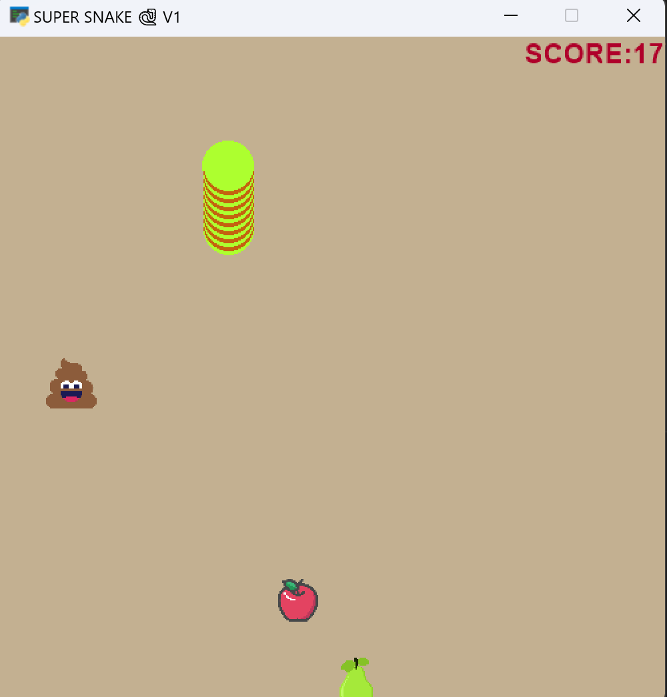

# Assigment 13

# Snake Game


In this game, the snake must seek the fruits. The snake moves right, left, up and down 

>## Game instructions
|  |                        |
|-------------------|------------------------|
| move to right     | select arrow key right |
| move to left      | select arrow key left  |  
| move to up        | select arrow key up    |
| move to down      | select arrow key down  |


By eating each of the objects in the window, the length of the snake's body will increase and the player's score will change as follows:

## score
* The score of the snake can be seen on the game screen.

* By eating each 🍎, the length of the snake's body will increase by one unit.

* By eating each 🍐 snake score increases by 2 units.

* If the snake eats 💩, 1 point will be deducted from its score.


>## Game over modes:
1. Snake get out of the window
2. The player's score becomes zero
  


>## Libraries
Libraries required to run the program:
```
pip install arcade
```
imports in main:
```
import arcade
from apple import Apple
from pear import Pear
from shit import Shit
from snake import Snake    
```


## How to run the code in windows (10,11):
```
cmd ---> python main.py
************************
cmd ---> python main_AI.py
```


---
| File      | Description |
| ----------- | ----------- |
|main| a Mini Game on progress |
|main_ai |very simple AI play game|


>## How to Run
execute this command in terminal :
python file_name.py
example python main.py

> ## play with AI 🎮

+ just run main_ai.py file and let AI feed your snake  🐍


